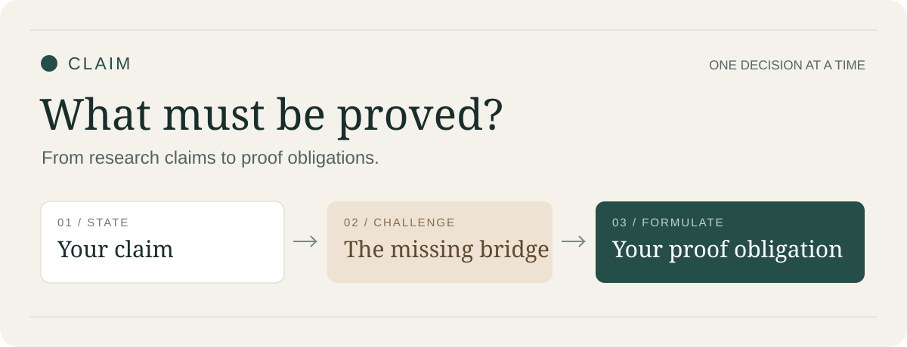

# Claim



## 把论文想说明的结论，写成真正需要证明的命题

你有一个研究想法，也能说明它为什么重要。但当论文需要理论支撑时，最难的问题往往是：**究竟缺少哪一步推理，应该证明什么？**

Claim 围绕这个问题组织科研对话。它帮助你明确主张、检查反例、权衡假设，并亲自写出定理义务——让论证成立所需要的证明目标。需要直接检查或形式化时，也可以进入 Review 或 Lean 证明路线。

[开始使用](#开始使用) · [看一个案例](docs/examples.md) · [CLI 与客户端](docs/cli.md) · [Lean + Prove2Me](docs/proof-workflow.md)

**0.3.0 · internal** · 支持通用 CLI、Claude Code 和 Codex · 可与本地 ZYR 协作

## Claim 帮你处理什么

**前提成立，结论却没有接上。**

每个点分别成立的结论，未必能同时覆盖整个范围。Claim 找出尚未成立的推理，并检查证明目标是否包含结论真正要求的量词。

**反例出现，假设越加越多。**

新增条件可能排除最重要的应用范围。Claim 先让你尝试提出最小条件，再检查它阻断了什么反例、牺牲了什么范围，以及是否只是重述结论。

**知道定理名字，却写不出要证明哪一句。**

“用集中不等式”还不是证明义务。Claim 对照你写出的输入、输出、量词和误差，解释最影响结论的一处缺项，再进入定理检索。

## 看一次具体反馈

> **学习者：**“每个点的函数值都趋于零，所以整个区间的误差最终可以同时任意小。”
>
> **Claim：**“每个点分别等到误差足够小，不代表存在一个所有点共用的起点。你还缺少整个区间上的统一误差控制。”
>
> **留给学习者的问题：**“要让所有点同时满足要求，你需要的结论与已有逐点结论有什么不同？”

[完整案例](docs/examples.md)使用与研究项目无关的经典实分析问题，练习量词顺序、移动反例、范围修订和统一误差义务，并附一道极限与求导的迁移题。正式辅导逐轮展开，不提前展示解答。

## 开始使用

下载 [Claim-0.3.0.zip](dist/Claim-0.3.0.zip)，解压后保留完整 `claim/` 文件夹。以下命令从仓库根目录或解压目录执行，需要 Python 3.10+。

### 用 CLI 启动对话

已经安装 Claude Code：

```bash
python claim/scripts/claim.py run --client claude --request "逐轮引导我分析论文主张，不要替我完成理论"
```

使用 Codex CLI：

```bash
python claim/scripts/claim.py run --client codex --request "逐轮引导我分析论文主张"
```

启动器调用你选定的原生客户端，沿用客户端的模型、账户和交互权限。先看启动参数而不发起对话，可加 `--dry-run`。

### 安装到 Claude Code 或 Codex

| 客户端 | 安装位置 | 调用方式 |
|---|---|---|
| Claude Code | `~/.claude/skills/claim/`，或项目的 `.claude/skills/claim/` | `/claim` |
| Codex | `$CODEX_HOME/skills/claim/`；默认 `~/.codex/skills/claim/` | `$claim` |
| 其他助手 | 保留完整文件夹，明确要求读取 `SKILL.md` | 使用助手自己的文件或上下文入口 |

已有旧版时先备份，再替换完整文件夹。[各平台安装命令与升级说明 →](docs/cli.md)

### 只导出上下文

```bash
python claim/scripts/claim.py prompt --mode coach --request "我的论文主张是……" --output claim-context.md
```

将生成的 UTF-8 文件交给其他助手，并让它能够读取完整 `claim/` 文件夹。科学讨论需要网页检索；只有文本输入、没有联网工具的客户端可以阅读协议，但无法完成来源核验。

## 按你需要的帮助选择模式

| 目标 | 示例请求 | 工作方式 |
|---|---|---|
| 训练自己的理论判断 | “引导我，不要替我完成” | 每轮一个决定，假设和证明义务由你先尝试 |
| 理解当前概念 | “详细解释这个区别，不推进阶段” | 当前阶段深入讲解，结束后仍由你判断 |
| 直接检查论证 | “检查这条主张和证据” | 给出首个缺口、来源适用性和具体修改建议 |
| 整理确认结果 | “将已确认的当前版本归档” | 导出主张、条件、证明目标和未决项 |
| 写形式证明 | “把这条确认过的义务写成 Lean 证明” | 核对形式命题、证明依赖和实际编译结果 |

Coaching、Review 和形式证明各有分工。需要换模式时明确说明，已有用户判断与版本记录继续保留。

## 证明可以继续做到哪一步

```text
确认的研究主张
  → 明确的定理义务
  → 自然语言论证与子引理
  → Lean 形式化、编译与公理检查
  → 可选 Prove2Me 依赖图与验证状态
  → 回查定理条件与算法实现
```

Lean 检查形式命题的证明；Prove2Me 用来组织目标、分解义务并核对提交结果。Claim 负责解释这些结果与原论文主张的关系，区分“这个命题已证明”和“当前实现满足它的条件”。

包内提供一个[可运行的 Lean 小例子](claim/assets/proof-demo/ClaimDemo.lean)，证明两个偶数相加仍为偶数，展示形式化目标、见证构造和公理检查。[运行与证明链说明 →](docs/proof-workflow.md)

## 与本地 ZYR 配合

Claim 专注主张和证明义务；需要更广的研究、代码或写作工作时，可以把当前版本、已确认条件和剩余任务交给本地 ZYR。ZYR 也可以将理论辅导交回 Claim。

```text
使用 Claim 帮我确认定理义务，再交给本地 ZYR 处理证明与实现对应关系。
辅导阶段仍由我先作答。
```

两者分别管理版本。Claim 独立安装即可使用；本地存在 ZYR 时按实际入口协作。[互通方式 →](docs/cli.md#与本地-zyr-协作)

## 认真对待反对意见与研究者的判断

每次增加或修改实质性科学内容，Claim 都要求重新搜索相关文献。保留旧文献需要重新打开并核对适用性；提出反对意见时要给出原命题、条件、作者、年份和直接来源。

公式中的变量、集合、下标与概率对象必须解释清楚。改变对象、量词或假设时保留旧版本，并重做受影响的后续判断。详细解释、渐进提示和迁移练习都围绕同一目标：让你能说明自己为什么作出这个理论判断。

## 文档与验证

- [使用指南](docs/guide.md)：逐轮格式、假设提示、修订与迁移。
- [CLI 与客户端](docs/cli.md)：安装、启动、上下文导出及本地 ZYR。
- [形式证明路线](docs/proof-workflow.md)：Lean、Prove2Me 和实现对应关系。
- [验证记录](docs/validation.md)：发行检查、CLI 测试、Lean 示例与尚未开展的教学评测。
- [设计依据](docs/design-notes.md)：教学来源与具体设计选择。
- [版本记录](docs/changelog.md) · [校验和](dist/SHA256SUMS.txt) · [入口协议](claim/SKILL.md)

文件与程序验证、模型是否遵守教学协议、研究者是否学会，是三个分别评估的问题。当前已执行的检查和未测项目都列在验证记录中。
