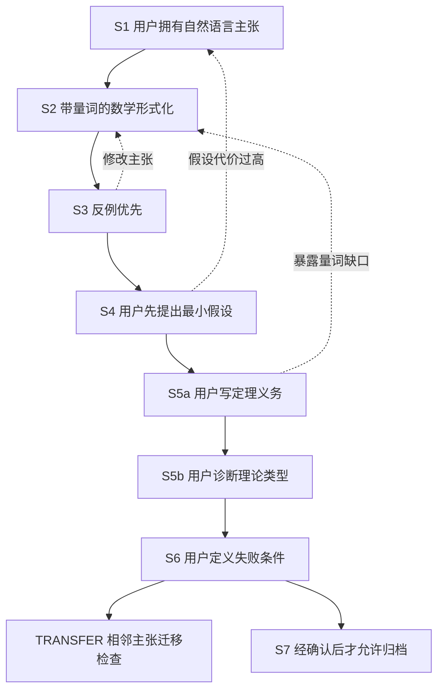

# Claim

> 从“我想让读者相信什么”出发，训练研究者亲自发现反例、选择假设、写出定理义务，并用可核验文献约束每一步判断。


Claim 不是普通的论文润色提示词，也不是让 AI 一次性生成“漂亮理论框架”的自动写作器。它是一套面向研究主张的理论辅导状态机：把研究者希望成立的 headline claim，逐步变成可以质疑、可以形式化、可以证明，也可以被明确放弃的理论对象。

它保护一件很容易在 AI 辅助研究中丢失的东西：**研究者本人对主张、假设、定理义务和失败条件的判断所有权。**

## 为什么需要 Claim

研究讨论最危险的失败方式，往往不是公式写错，而是更早发生的概念漂移：

- 论文真正想声称的是任务优势，证明的却只是代理距离变小；
- 反例刚出现，AI 就自动增加假设，把原主张修到无法失败；
- 用户还没有说明缺失桥梁，AI 已经给出定理名字和证明路线；
- 新的限定、量词或机制出现后，仍然机械沿用上一轮文献；
- 一行公式堆满英文缩写和符号，却没有说明每个变量究竟是什么；
- 旧版本在失败后被悄悄改写，最终文档看似自洽，却无法还原研究判断过程。

Claim 把这些风险变成显式协议和硬性阶段门。目标不是替研究者显得更理论，而是帮助研究者真正形成这条能力链：

```text
想让读者相信什么
  -> 精确对象、范围和量词是什么
  -> 哪个最小反例可以推翻它
  -> 愿意付出什么假设代价
  -> 第一条不成立的推理箭头在哪里
  -> 需要怎样的输入—输出型定理义务
  -> 它属于哪一种或哪几种理论问题
  -> 什么结果出现时必须降级或停止
```

## 核心能力

| 能力 | Claim 的处理方式 |
|---|---|
| 理论辅导 | 一轮只推进一个研究者拥有的决定，不替用户闯关 |
| 主张形式化 | 将自然语言 claim 转成带定义域、量词、概率语义和比较对象的数学命题 |
| 反例优先 | 在增加假设、寻找定理和设计实验前，先寻找最小致命反例 |
| 假设训练 | 用户先提出最小限制；AI 采用逐级提示，不直接填答案 |
| 定理义务训练 | 用户先写定理的输入、输出、保证方式、误差和样本性质 |
| 理论类型诊断 | 允许开放类别、复合缺口和 `UNKNOWN`，避免退化成标签竞猜 |
| 深度讲解 | `DEEP_DIVE` 可以充分解释当前概念，但不推进阶段或替用户决策 |
| 证据反对 | `EVIDENCE_CHALLENGE` 必须网页检索，并给出适用性与限制分析 |
| 文献刷新 | 每次新增科学内容都重新检索；旧文献不能自动继承 |
| 公式可读性 | 每个公式都必须解释变量、取值域、维度、依赖关系和中文含义 |
| 版本回退 | claim 修改会保留旧版本，并自动重新打开受影响的后续阶段 |
| 迁移检查 | 用相邻但不同的主张检查方法迁移，而不把一次共同完成冒充掌握 |
| 完整审计路由 | 用户明确要求代为完成时，可路由到审计、证据矩阵或证明验证工具 |

## 两种工作模式

### Coaching：教我如何判断

适合这些请求：

- “教我如何从论文主张反推需要的定理。”
- “不要替我完成，请逐轮训练我的判断。”
- “先给我反例，让我自己决定接受什么假设。”
- “详细解释这个概念，但不要进入下一阶段。”

Coaching 模式坚持用户拥有：

- headline claim；
- 范围排除；
- 假设尝试与接受决定；
- theorem obligation 尝试；
- 理论类别判断；
- 可证伪的失败规则。

上下文再充分，AI 也不能擅自从 Coaching 切换到 Audit。

### Audit：帮我完整检查

适合这些请求：

- “完整审计这个理论主张。”
- “生成 implication DAG 和 theorem ladder。”
- “检查主张、证据和论文措辞是否一致。”
- “验证这段具体证明，找出第一个证明缺口。”

Audit 是交付导向；Coaching 是能力训练导向。Claim 把二者明确分开，避免“AI 替用户完成研究”伪装成“AI 在教用户研究”。

## Coaching 状态机



| 阶段 | 用户必须亲自完成什么 | AI 可以做什么 | AI 不可以做什么 |
|---|---|---|---|
| S1 | 说明对象、条件、比较对象和结论 | 拆解原话、指出最大缺项 | 从旧稿替用户选主张 |
| S2 | 确认数学命题仍是原意 | 形式化并逐符号映射 | 偷偷加强或修复主张 |
| S3 | 判断反例是否在范围内及排除代价 | 构造一个最小反例 | 同时给出修复假设 |
| S4 | 先尝试提出最小条件 | 检查必要性、代价和可观察性 | 在用户尝试前给答案 |
| S5a | 写出缺失桥梁的输入与输出 | 指出最大量词或对象缺口 | 直接代写完整定理义务 |
| S5b | 解释坏箭头为何失败并尝试分类 | 校正并匹配最小理论工具 | 把理论研究变成封闭选择题 |
| S6 | 给出真正能改变结论的失败规则 | 检查可观察性与可证伪性 | 先替用户规定停止标准 |
| S7 | 明确要求归档 | 生成正式审计或理论文档 | 在前序阶段未通过时提前写报告 |

## 深度教学，而不是机械闯关

### `DEEP_DIVE`

当用户明确要求详细解释当前概念时，Claim 可以深入讲解定义、公式、中性例子、反例和不同理论对象的后果。深度讲解不会改变 gate，也不会借机给出下一阶段答案。

### 渐进式提示

在假设阶段，提示按以下顺序逐步增加：

1. 不提示，只要求用户先尝试；
2. 只指出反例利用了哪个自由度；
3. 用无关领域的中性类比解释该自由度；
4. 用户仍明确无法表达时，最多给出一个带代价的候选假设。

这套设计提供思维脚手架，而不是答案填充器。

### `LEARNING_REVIEW`

每个阶段通过后，Claim 会简短说明用户刚才使用了什么理论分析能力，以及该判断为何约束下一步需要的理论性质。它不重复答案，也不把“通过当前 claim”宣传成已经掌握理论研究。

### `TRANSFER`

完成一个 claim 后，可以使用相邻但不同的主张检查迁移能力。只有用户在没有答案型提示的情况下，独立识别对象、量词和第一条坏箭头，才记录为有限的初步迁移证据。

## 证据优先的反对机制

Claim 不会因为用户的想法不熟悉或不常见就判定它错误。模型内部知识只作为搜索触发器，不作为反对意见的权威来源。

当一个观点可能与定理、正式定义、官方标准、数据契约或可信实验结果冲突时，`EVIDENCE_CHALLENGE` 会：

- 暂停当前 gate；
- 搜索支持观点和反对观点的资料；
- 优先打开原始论文、官方标准、正式文档和规范来源；
- 核验 DOI、版本、勘误、撤稿、对象、假设、范围、比较对象和量词；
- 给出完整参考文献信息、直接链接、精确支持命题、适用性和局限；
- 区分直接冲突、条件冲突、竞争解释、临时挑战和证据不足；
- 把是否修改主张的决定交还给用户。

## 每次新内容都重新检索

Claim 0.1 不允许把上一轮参考文献整批复制到下一轮。只要用户新增或改变了主张、定义域、比较对象、量词、假设、机制、证明步骤、指标、数据、实验结果、范围或失败规则，就必须重新执行网页文献检索。

旧来源会先降级为 `PRIOR_SOURCE_CANDIDATE`。只有当轮重新打开并核验仍然适用，才能标记为 `REVALIDATED_PRIOR_SOURCE`。最终仍然使用同一篇文献是允许的，但必须来自新的检索和适用性判断，而不是惯性继承。

检索不会破坏教学阶段门：在用户完成 S5b 之前，资料可以帮助解释概念、核验事实和支持反例，但不能被用来替用户选择假设、代写定理义务或抢先推荐定理族。

## 公式必须让人看懂

Claim 对所有公式执行统一可读性合同。每个展示公式和非平凡行内公式都必须：

- 先说明公式表达什么以及为什么出现在这里；
- 紧跟符号表，列出中文含义、类型或取值域、形状/维度/单位、角色与依赖关系；
- 解释变量、索引、集合、函数、参数、估计量、随机变量、非标准算子、上下标、条件表达式、范数、量词和概率测度；
- 首次出现时展开英文缩写，并给出中文解释；
- 用中文说明输入、运算、输出以及它与当前 claim 的关系；
- 不知道的含义明确写成 `UNKNOWN`，而不是猜测。

“专家应该知道”不能成为省略定义的理由。

## 可追溯的主张版本

真实研究会反复修改主张。Claim 允许回退，但不允许悄悄漂移：

- 保留旧版本及其状态；
- 记录用户原话、修改原因和触发事件；
- 创建新的 claim 版本；
- 自动重新打开依赖于改动字段的后续 gate；
- 对失败后隐藏旧版本、改变量词或增加近似结论式假设的行为标记 `POST_HOC_RISK`。

因此，合理修订和失败后的包装不会被混为一谈。

## 快速开始

### 从压缩包安装

Windows PowerShell：

```powershell
Expand-Archive -LiteralPath .\dist\Claim-0.1.zip -DestinationPath "$env:CODEX_HOME\skills" -Force
```

macOS / Linux：

```bash
unzip dist/Claim-0.1.zip -d "${CODEX_HOME:-$HOME/.codex}/skills"
```

安装后应存在：

```text
$CODEX_HOME/skills/claim/SKILL.md
```

重新启动或刷新支持 skills 的客户端，然后使用 `$claim`。

### 直接从仓库安装

将仓库中的 `claim/` 目录完整复制到本机 skills 目录，不要只复制 `SKILL.md`；内部 coaching 协议位于 `claim/references/theory-coach.md`。

### 推荐提示词

```text
Use $claim to teach me how to derive the theorem obligation from this claim.
```

```text
使用 $claim 逐轮训练我判断这个主张需要什么定理，不要替我完成。
```

```text
使用 $claim 详细解释当前概念，但保持 gate 不变。
```

```text
使用 $claim 完整审计这个理论主张，并区分已证明、需条件化和 UNKNOWN。
```

## 项目结构

```text
Claim/
├── README.md
├── VERSION
├── manifest.json
├── claim/
│   ├── SKILL.md
│   ├── agents/
│   │   └── openai.yaml
│   └── references/
│       └── theory-coach.md
└── dist/
    ├── Claim-0.1.zip
    └── SHA256SUMS.txt
```

`claim/` 是完整的单一 skill 安装目录。README、版本文件和发行归档保留在仓库根目录，不会增加 skill 运行时上下文。

## 可选路由依赖

Claim 的核心 Coaching、`DEEP_DIVE`、`EVIDENCE_CHALLENGE`、文献刷新、公式解释、版本回退和迁移检查都包含在本仓库中。

以下完整交付型路由属于可选兼容能力，需要目标环境安装相应 skill：

- `theory-claim-audit`：完整理论审计、DAG、theorem ladder 和 verdict；
- `zyr-s203-claim-evidence-matrix`：主张—证据矩阵；
- `zyr-s207-contribution-claim-refinement`：贡献主张精炼；
- `zyr-s226-logic-consistency-audit`：逻辑一致性审计；
- `zyr-s230-proof-idea-check`、`zyr-s235-proof-gap-finder`：证明思路和缺口；
- `zyr-s240-pessimistic-proof-verification`、`zyr-s241-progressive-proof-verification`：证明验证；
- `zyr-s237-theorem-assumption-normalizer`：定理假设与量词规范化；
- `zyr-s433-formal-proof-adapter`：形式化证明脚手架；
- `zyr-s527-claim-language-risk-linter`：论文表述风险检查。

缺少可选依赖时，不应伪装成对应审计已经完成；仍可继续使用本仓库内置的 Coaching 协议。

## 0.1 版本状态

内部版本 `0.1` 建立了 Claim 的核心方法合同：

- 单一 `$claim` 入口；
- Coaching 与 Audit 意图隔离；
- S1–S7 阶段门；
- S5a 用户先写 theorem obligation；
- S4 渐进式假设提示；
- `DEEP_DIVE`、`LEARNING_REVIEW` 与 `TRANSFER`；
- 网页证据支持的反对机制；
- 每次新增科学内容强制刷新文献；
- 全局公式变量解释合同；
- claim 版本回退与下游 gate 失效规则；
- 可安装 ZIP 与 SHA-256 校验。

这是内部首发版本，不代表已经在所有学科、模型和工作流中完成广泛验证。

## 验证

发布包在提交前执行：

- skill frontmatter 与目录结构验证；
- UTF-8 严格解码；
- 中文乱码扫描；
- 源目录与压缩包逐文件 SHA-256 一致性检查；
- ZIP 解压后独立 skill 验证；
- Git 工作树和发行文件清单检查。

验证通过证明结构和发行物一致，不等于证明所有理论结论、文献判断或教学迁移效果正确。

## 适用范围与边界

Claim 适合理论导向的论文构思、研究主张审计、证明规划、证据对齐和研究能力训练。它不能替代：

- 领域专家对新定理的正式同行评议；
- 完整系统综述或注册式证据综合；
- 数学证明检查器或 theorem prover 的最终验证；
- 实验数据、实现行为和论文主张之间的真实绑定；
- 用户对研究伦理、失败规则和发表责任的最终决定。

Claim 的原则不是“AI 永远正确”，而是让不确定性、来源、假设代价和失败路径更难被隐藏。

## Roadmap

- 增加跨学科的匿名化 coaching 回归测试；
- 为文献刷新、符号完整性和 gate 越级建立自动化静态检查；
- 扩展 transfer exercise 的难度分层；
- 建立可选择的审计依赖安装清单；
- 在不削弱用户判断所有权的前提下改进长周期研究状态恢复。

## 贡献

欢迎提交能够提高教学真实性、证据可核验性和理论边界清晰度的改进。提出修改时，请同时说明：

1. 当前协议在哪种真实对话中失败；
2. 失败是否让 AI 接管了用户判断，或让不确定性被隐藏；
3. 修改会影响哪个 gate；
4. 如何验证修改没有引入新的越级行为。

## License

内部版本 0.1 暂未附带开源许可证。在公开发布前，应由项目所有者明确选择许可证；公开可见不自动授予复制、修改或再分发权利。

---

**Claim：不要从方便的定理出发包装主张，要从真正想让读者相信的东西出发，找到必须被证明的第一条桥梁。**
