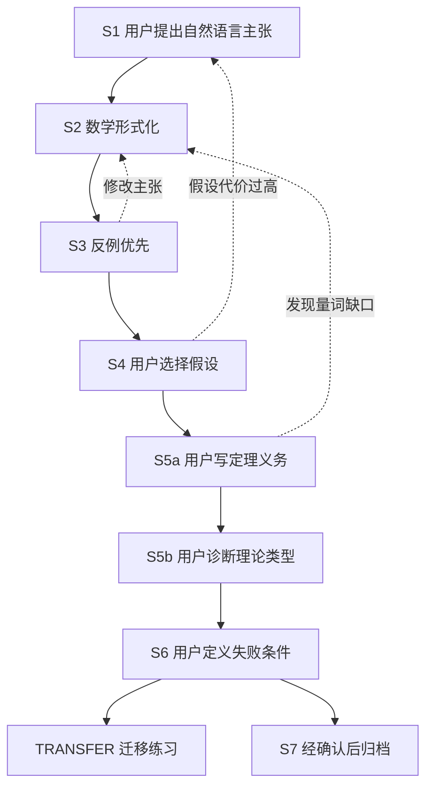

# Claim

> 让 AI 不再替你“完成理论”，把“这篇论文究竟需要证明什么”的判断过程交还给研究者。


Claim 是一个面向科研对话的 Codex skill。它从研究者亲自提出的论文主张出发，用数学形式化、反例、假设选择、定理义务和失败条件，把一个“听起来合理”的想法组织成边界更清楚、可以逐项检查的理论任务。

Claim 的核心不是自动生成更多理论内容，而是保护研究者对四件事的决定权：

- 论文的中心主张是什么；
- 哪些情况愿意排除；
- 哪些假设可以接受；
- 什么结果出现时必须承认主张失败。

## 一分钟了解

### 它解决什么问题

AI 很容易快速写出一套完整理论叙事，但“完整”不等于“正确”，也不等于研究者真正理解了推理链。常见问题包括：

- 论文想说明任务表现更好，定理却只控制了一个代理指标；
- 反例刚出现，AI 就增加假设，把原主张修成几乎不可能失败；
- 研究者还没有说明缺失的桥梁，AI 已经替他选择定理；
- 主张的范围或量词改变后，仍然沿用上一轮文献；
- 公式中充满符号和英文缩写，却没有说明它们对应什么科学对象；
- 证明或实验失败后，旧主张被悄悄改写，失败记录随之消失。

Claim 把这些风险转化为明确的对话阶段和硬规则。

### 协议按什么顺序推进

```text
自然语言主张
  → 明确对象、条件、比较对象和结论
  → 写成带定义域与量词的数学命题
  → 寻找能够推翻它的最小反例
  → 由研究者选择愿意承担的假设
  → 找出第一条尚未成立的推理箭头
  → 由研究者写出需要的定理义务
  → 判断缺口属于哪类理论问题
  → 明确什么结果意味着失败
  → 经确认后再整理正式文档
```

这里的“定理义务”（theorem obligation）不是某个定理的名字，而是为了让一条推理成立，必须证明的输入—输出型结论。

### 它不是什么

Claim 不是：

- 自动证明器；
- 一键生成论文理论章节的提示词；
- 用文献数量替代适用性判断的搜索器；
- 在没有证据时替用户宣布想法正确或错误的裁判。

它是一套研究协作协议：让主张、假设、证据、证明和失败条件始终可以区分、追溯和复查。

## 快速开始

### 1. 安装

克隆仓库：

```bash
git clone https://github.com/ARC0127/Claim.git
cd Claim
```

Windows PowerShell：

```powershell
$claimSkillsRoot = if ($env:CODEX_HOME) {
    Join-Path $env:CODEX_HOME "skills"
} else {
    Join-Path $env:USERPROFILE ".codex\skills"
}

Expand-Archive -LiteralPath ".\dist\Claim-0.1.zip" `
    -DestinationPath $claimSkillsRoot
```

macOS 或 Linux：

```bash
claim_skills_root="${CODEX_HOME:-$HOME/.codex}/skills"
unzip dist/Claim-0.1.zip -d "$claim_skills_root"
```

安装完成后，应当存在：

```text
<skills directory>/claim/SKILL.md
```

如果目标位置已经存在 `claim/`，先检查并备份旧版本。以上命令故意不强制覆盖，避免未经确认替换现有 skill。

刷新或重新启动支持 skills 的客户端，然后调用 `$claim`。

也可以不使用 ZIP，直接把仓库中的整个 `claim/` 目录复制到 skills 目录。不要只复制 `SKILL.md`，因为完整的 coaching 协议位于 `claim/references/theory-coach.md`。

### 2. 选择工作方式

如果你希望训练自己的理论判断能力：

```text
使用 $claim 逐轮训练我从这个论文主张反推需要的定理。
不要替我完成，也不要提前给出假设和定理路线。
```

如果你希望深入理解当前概念，但不推进阶段：

```text
使用 $claim 详细解释当前阶段的这个概念，保持当前阶段门（gate）不变。
```

如果你明确需要一份完整审计：

```text
使用 $claim 完整审计这个理论主张，并区分已证明、需要条件化和 UNKNOWN。
```

### 3. 先说你真正想声称什么

Coaching 模式从一句自然语言开始：

```text
我希望审稿人相信：在……条件下，我们的方法相对于……，能够……。
```

不需要先知道定理名字，也不需要先写数学符号。Claim 会先帮助你锁定科学对象，而不是从一个方便的现成定理倒推论文应该声称什么。

## 两种模式：训练判断，或者完成审计

### Coaching：训练研究者自己判断

当用户说“教我”“引导我”“逐轮进行”或“不要替我做完”时，Claim 进入 Coaching。

Coaching 的目标是让用户亲自完成关键判断。AI 提供形式化、反例、解释、提示和一致性检查，但不能替用户接受假设、选择中心主张或规定失败条件。

上下文再充分，Claim 也不能擅自从 Coaching 切换到 Audit。

### Audit：交付完整检查结果

当用户明确要求“完整审计”“生成 implication DAG”“给出 theorem ladder”或“一次性完成”时，Claim 才进入 Audit。

Audit 以交付结果为目标；Coaching 以培养判断过程为目标。二者都重要，但不能混为一谈。

> `implication DAG` 是主张推理链的有向无环图；`theorem ladder` 是按照依赖顺序组织的定理层级。

## Coaching 怎样运行



| 阶段 | 用户的任务 | AI 的任务 | 通过条件 |
|---|---|---|---|
| S1 主张 | 说明对象、条件、比较对象和结论 | 拆解原话，只指出最重要的缺项 | 中心主张来自用户本人 |
| S2 形式化 | 确认数学命题是否仍是原意 | 写明定义域、量词、概率语义和符号对应 | 用户明确确认 |
| S3 反例 | 判断反例是否属于论文范围，以及是否愿意排除 | 构造一个保留原前提的最小反例 | 范围与排除代价由用户判断 |
| S4 假设 | 先尝试提出阻断反例的最小条件 | 检查必要性、代价和可观察性 | 用户锁定接受、拒绝与未决假设 |
| S5a 桥梁 | 描述需要证明的输入、输出和保证强度 | 检查它是否真正封闭坏箭头 | 用户亲自写出一次定理义务 |
| S5b 分类 | 解释坏箭头为什么不成立，并判断理论类型 | 校正分类，寻找最小相关理论工具 | 用户完成解释和分类尝试 |
| S6 失败 | 说明什么反例或结果会改变结论 | 检查规则能否真正证伪主张 | 存在可观察、非循环的失败规则 |
| S7 归档 | 明确要求生成正式材料 | 整理已确认的主张、DAG 和定理路线 | S1–S6 已通过 |

每个普通 coaching 回合只推进一个决定，并只留下一个需要用户亲自回答的问题。这项限制用来防止 AI 在一个回合中同时给出反例、修复假设、定理和实验方案。

## 它怎样进行深入教学

严格的阶段门不意味着只能给机械的短回答。Claim 提供三种教学机制。

### `DEEP_DIVE`：只讲透当前概念

当用户明确要求详细解释时，Claim 可以展开定义、公式、中性例子、反例以及不同理论对象的区别。解释结束后，仍然回到原阶段，不借机替用户做决定。

### 渐进式提示：先给脚手架，再考虑答案

在假设阶段，提示依次增加：

1. 先要求用户独立尝试；
2. 只指出反例利用了哪个自由度；
3. 用无关领域的中性例子解释该自由度；
4. 用户仍明确无法表达时，最多提供一个带代价的候选假设。

候选假设仍然只是 `AI_HINT`，是否接受由用户决定。

### `LEARNING_REVIEW` 与 `TRANSFER`：回看判断并测试初步迁移

一个阶段通过后，Claim 会简短说明用户刚才完成了什么理论判断，以及该判断如何限制下一步需要的结论。

完成当前主张后，`TRANSFER` 会给出一条相邻但不同的主张，让用户独立识别对象、量词和第一条坏箭头。一次迁移练习只能提供有限的初步证据，不能证明用户已经普遍掌握理论研究。

## 文献不是装饰：每次新内容都重新检索

只要用户新增或改变了科学内容，例如主张、定义域、比较对象、量词、假设、机制、证明步骤、指标、数据、实验结果、范围或失败规则，Claim 就要求重新执行网页文献检索。

上一轮使用过的文献会先变成 `PRIOR_SOURCE_CANDIDATE`，即“需要重新核验的旧来源候选”。只有在当前回合重新打开、检查版本并确认仍然适用后，它才能变成 `REVALIDATED_PRIOR_SOURCE`。

这条规则要求的是重新检索和重新判断，不是为了显得勤奋而强行更换文献。同一篇论文可以继续使用，但必须说明它为什么仍然适用于新的主张范围。

检索必须同时寻找：

- 支持当前想法的证据；
- 反例、冲突结果或竞争解释；
- 与当前对象、假设、范围和量词真正匹配的原始来源。

在用户完成 S5b 之前，检索结果可以帮助解释概念、核验事实和构造反例，但不能被用来替用户选择假设、代写定理义务或提前推荐定理族。

## 当文献反对用户时，Claim 应该怎样说

如果用户的观点可能与直接适用的定理、正式定义、官方标准、数据契约或可信实验结果冲突，Claim 进入 `EVIDENCE_CHALLENGE`。

它必须先搜索网页，再提出反对意见。回应需要说明：

- 被质疑的准确命题是什么；
- 最强的反对推理是什么；
- 每项来源具体支持什么；
- 来源的对象、假设、范围、比较对象和量词是否匹配；
- 来源没有证明什么；
- 证据属于直接冲突、条件冲突、竞争解释，还是仍然不足。

“没有找到支持文献”不等于“用户的想法错误”。如果直接来源无法访问或证据不能决定命题，Claim 必须保留 `UNKNOWN`。

## 公式必须解释到可以阅读

Claim 不允许只摆出一行公式，再假设读者认识其中所有符号。每个展示公式和非平凡的行内公式都必须：

- 先说明这个公式要表达什么；
- 紧跟符号表；
- 解释每个变量、索引、集合、函数、参数、估计量和随机变量；
- 写明类型或取值域、形状、维度、单位、角色和依赖关系；
- 解释上下标、条件表达式、范数、量词和概率或期望所对应的测度；
- 首次出现时展开英文缩写并给出中文含义；
- 最后用中文说明输入、运算、输出以及它与当前主张的关系。

无法确认的信息标记为 `UNKNOWN`，不能靠猜测补齐。“领域专家都知道”不是省略定义的理由。

## 主张可以修改，但不能偷偷漂移

研究过程中修改主张很正常。Claim 允许用户随时修订已经确认的内容，但会：

- 保留旧版本；
- 记录用户修改了什么、为什么修改以及由什么触发；
- 建立新的主张版本；
- 重新打开所有依赖于该修改的后续阶段；
- 对失败后隐藏旧版本、悄悄改变量词或加入近似结论式假设的情况标记 `POST_HOC_RISK`。

这样可以区分透明的科学修订和为了躲避反例而进行的事后包装。

## 本仓库包含什么

```text
Claim/
├── README.md
├── VERSION
├── manifest.json
├── claim/
│   ├── SKILL.md
│   ├── agents/
│   │   └── openai.yaml
│   └── references/
│       └── theory-coach.md
└── dist/
    ├── Claim-0.1.zip
    └── SHA256SUMS.txt
```

本仓库内置并可独立使用的部分包括：

- `$claim` 单一入口；
- Coaching 状态机；
- `DEEP_DIVE`；
- `EVIDENCE_CHALLENGE`；
- 文献刷新规则；
- 公式解释规则；
- 主张版本回退；
- 迁移练习。

## 哪些能力需要可选依赖

Claim 可以把交付型任务路由到其他已安装 skills。以下能力不是 `Claim-0.1.zip` 的内置内容：

| 任务 | 可选 skill |
|---|---|
| 完整理论审计、推理 DAG 和定理路线 | `theory-claim-audit` |
| 主张—证据矩阵 | `zyr-s203-claim-evidence-matrix` |
| 贡献主张精炼 | `zyr-s207-contribution-claim-refinement` |
| 逻辑一致性审计 | `zyr-s226-logic-consistency-audit` |
| 证明思路与缺口检查 | `zyr-s230-proof-idea-check`、`zyr-s235-proof-gap-finder` |
| 证明验证 | `zyr-s240-pessimistic-proof-verification`、`zyr-s241-progressive-proof-verification` |
| 定理假设与量词规范化 | `zyr-s237-theorem-assumption-normalizer` |
| 形式证明脚手架 | `zyr-s433-formal-proof-adapter` |
| 论文主张措辞风险检查 | `zyr-s527-claim-language-risk-linter` |

如果可选依赖不存在，Claim 不应假装相应的完整审计已经完成。核心 Coaching 功能仍然可以使用。

## 版本 0.1：已经验证什么

内部版本 `0.1` 已完成以下结构验证：

- skill frontmatter 和目录结构可以通过 validator；
- 仓库文本可以严格按 UTF-8 解码；
- 已检查常见中文乱码模式；
- 仓库 skill 与 ZIP 解压内容的逐文件 SHA-256 一致；
- ZIP 解压后可以再次通过 skill validator；
- 发布清单、版本号和文件路径一致。

这些检查证明的是安装包结构和内容一致性。它们**不证明**：

- Claim 已在所有学科中有效；
- 用户经过一次 coaching 就获得了普遍的理论研究能力；
- AI 给出的文献判断或数学判断必然正确；
- 外部可选 skills 已随压缩包安装。

当前更准确的状态是：Claim 0.1 已形成可安装、可检查的核心协议，但广泛的跨领域教学效果仍是 `UNKNOWN`，需要后续回归测试和真实使用证据。

## 校验发行包

仓库中的 `dist/SHA256SUMS.txt` 记录了核心文件与 ZIP 的 SHA-256。PowerShell 示例：

```powershell
Get-FileHash -LiteralPath ".\dist\Claim-0.1.zip" -Algorithm SHA256
```

版本 0.1 的 ZIP 期望值为：

```text
210e37bcc8d5d72fd5e0ccee9d9c0f4a988bfbd792c9d65400e8938e631bb124
```

## 适用范围

Claim 适合：

- 从论文中心主张反推需要的理论结果；
- 训练量词、反例、假设代价和定理义务判断；
- 在写证明或实验计划前暴露第一条不成立的推理；
- 核对新文献是否真正适用于当前主张；
- 保留主张修改、失败与降级过程。

Claim 不能替代：

- 领域专家和同行评议；
- 完整系统综述；
- 形式化证明器的最终检查；
- 对真实代码、数据和实验结果的直接验证；
- 研究者对伦理、发表和失败条件的最终责任。

## 贡献方向

欢迎围绕以下问题提出改进：

- 哪种真实对话会让 AI 越过阶段门并接管用户判断？
- 哪条规则虽然合规，却没有真正帮助用户理解？
- 哪类主张无法被当前的反例、假设或定理义务流程覆盖？
- 如何用回归测试验证修改没有引入新的越级行为？

提交改进时，请给出失败对话、涉及阶段、建议修改和验证方式。不要只增加更多流程名称。

## License

内部版本 0.1 暂未附带开源许可证。项目公开可见不等于自动授予复制、修改或再分发权利；正式公开发布前，应由项目所有者选择并加入明确许可证。

---

**从想让读者相信的主张出发，找到第一条必须被证明的桥梁。**
